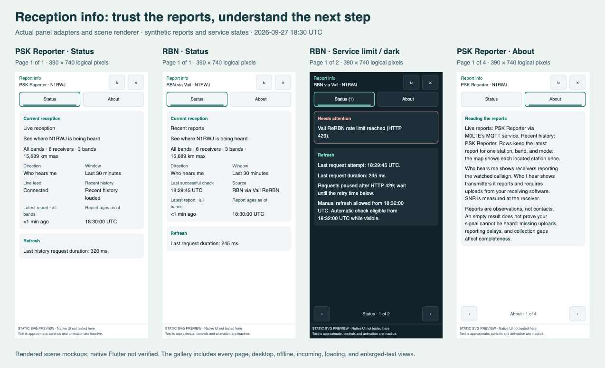

# PSK Reporter and RBN report info

The info button should help an operator answer **“Can I trust these reports,
and what should I do next?”** It is the explanation behind the reception map
and list: which station and direction are being observed, how current and
complete the observations are, and what their limits mean.

[Open the rendered mockup gallery](images/reception-info/index.html).
It includes both extensions, phone and desktop panels, incoming reception,
pending history, offline operation, server rate limiting, dark mode, and large
text. The gallery uses deterministic fixtures through the actual panel models
and scene renderer. It is a browser approximation of native text rendering,
not a Ham2K runtime acceptance test.

## What the investigation found

Both extensions use the same renderer in `packages/reception/src/ui/scene.ts`.
The old info view concatenated summary, warnings, notes, location, timestamps,
source information, and map credits into a single list of wrapped lines.
All lines had the same size and weight; blank lines provided the only grouping.

| Problem | Effect on the operator | Change |
| --- | --- | --- |
| Current conditions and reference material had equal prominence | Finding a failure or freshness fact required reading a prose dump | Separate **Status** and **About** views |
| Pagination cut at arbitrary lines | A page could start halfway through an explanation | Cards preserve whole paragraphs and fact groups when space permits; split cards repeat their heading |
| PSK supplied no snapshot-check timestamp | The generic view said “Data checked: never” even with a working live feed | Show live-feed and history states separately; report no invented check time |
| Latest-report age came from all bands | An empty selected band could appear to have a recent report | Compute the newest report from the visible band selection |
| PSK direction and configured window were implicit | Incoming and outgoing reception could be misinterpreted | Explicit **Direction** and **Window** facts |
| RBN repeated warnings and retrieval details | Longer pages obscured the actual problem | Keep warnings separate from request diagnostics and general explanations |
| Closing info reset list pagination | Investigation interrupted the operator's place in the reports | Save and restore the original report page |
| Long diagnostic tokens were never split | Native single-line text could hide the end of an error | Wrap long tokens explicitly as well as ordinary prose |

This is a presentation change. Feed collection, cache lifetimes, request
cooldowns, permissions, report selection, and extension identity keep their
existing contracts.

## Information order

**Status** answers the immediate questions. The header identifies the source
and watched callsign. Warnings appear first in a clearly labelled card. When
attention is needed, refresh/retry guidance follows the warning before the
longer reception summary. The summary shows the active band, station count,
band count, and maximum known distance. Labelled facts distinguish direction,
configured window, feed or retrieval state, latest visible observation, and the
time against which report ages were calculated.

PSK's live connection and recent history are independent: a connected socket
does not establish that history loaded or that any recent reports exist.
RBN's last successful check is a retrieval timestamp; it can legitimately
return older observations or no observations. These facts are displayed with
different labels rather than collapsed into a single “updated” timestamp.

**About** explains how to use the result: source provenance, what each row
represents, who measured SNR, why paths are not a coverage boundary, how
locations are obtained, and what automatic and manual reload do. It also
explains that changing the watched callsign does not relocate the operation's
map origin. Watching another station requires a matching origin grid for
useful distance and bearing estimates.

The controls remain beside reload, in their familiar position. Opening info
starts at Status. The close button returns to the report list's prior page;
changing the panel configuration resets that saved page because its contents
may have changed. Switching Status/About starts at the first page of that
view. A warning count remains on Status while About is open.

## Layout and accessibility

The layout uses host typography and colors. At ordinary phone widths, paired
facts occupy two columns; at narrow widths or larger accessibility text sizes,
they use one column. Desktop content has a bounded reading width. The native
text-layer order keeps each fact's label followed by its value even when two
facts appear beside one another.

Selected tabs have an underline and an accessible “selected” label. All
interactive controls retain at least 44 logical pixels in both dimensions.
Disabled pagination endpoints are not focusable controls. Pagination appears
only when content actually overflows, so a normal one-page Status view has no
permanent “1/1” toolbar.

The published SDK and local host source constrain this implementation:
`SvgScene` text layers render one line with ellipsis, and the host permits at
most 128 layers and 64 controls. The layout therefore wraps text itself,
reserves space using each role's scaled font size, and budgets both geometry
and layer count. It sends unscaled font sizes for the host to scale once.
Extremely small panels show an enlargement message when there is insufficient
room to read a card. Overflow remains paginated because native scene scrolling
is not part of this contract.

## Verification and follow-up

Deterministic tests cover selected-band freshness, empty views, long diagnostic
tokens, warning priority, tab events, report-page restoration, multiple panel
placements, scaled typography, safe insets, bounded scenes, and retention of
diagnostics across pages. Extension tests cover feed/history state, raw errors,
request duration bounds, source information, and successful-check semantics.
`mise run check` also builds and packages every extension using the official
tools and exercises the existing bundle/bridge tests.

Regenerate the mockups with `mise run reception:preview`; inspect all pages in
the gallery, not just the exported first-page SVGs. A final native Ham2K check
should cover actual font measurement, keyboard/screen-reader behavior, tab and
close events, and refresh completion while info is open. Browser previews and
unit/bundle tests do not establish those native runtime results.

For this change, `mise run check` passed all **726 tests across 60 files**, plus
lint, strict typechecking, builds, and official packaging for all seven
extensions. Browser inspection exercised scenario, tab, and page controls. A
browser text-width check across **51 pages in nine scenarios** found no text
exceeding its scene-layer width after the enlarged-text header correction.
The PNG overview above is a browser screenshot of the generated `overview.svg`;
recapture it after regenerating that SVG when refreshing this document.

Only PSK Reporter and RBN consume this reception UI. These changes do not
affect CWT, CQ WW, or their exchange/filter behavior, so neither upstream
contest PR requires synchronization.
